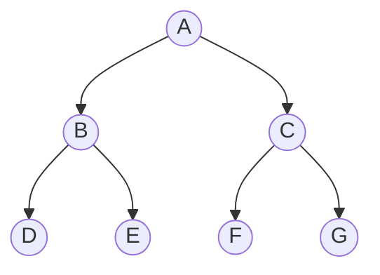

# BFS / DFS Graph Visualization

## Graph Structure



## Traversal Paths

### BFS

```text
A → B → C → D → E → F → G
```

### DFS

```text
A → B → D → E → C → F → G
```

## Comparison

| Algorithm | Data Structure | Traversal Style |
|---|---|---|
| BFS | Queue | Level by level |
| DFS | Stack | Depth first |

## Performance Graph

The actual execution-time graph should be generated from the local run because timing varies by machine. Use:

```bash
python bfs_dfs.py
py-spy record --output profile.svg -- python bfs_dfs.py
```

The `profile.svg` file produced by py-spy is a flame graph for the program.
